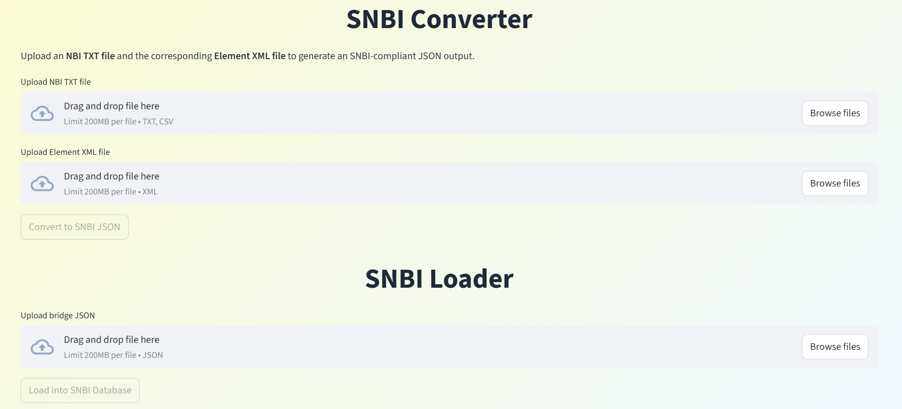
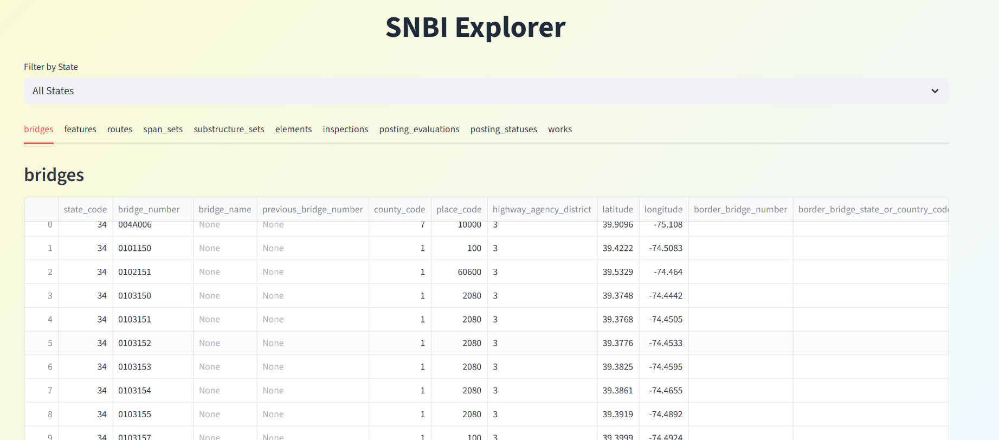
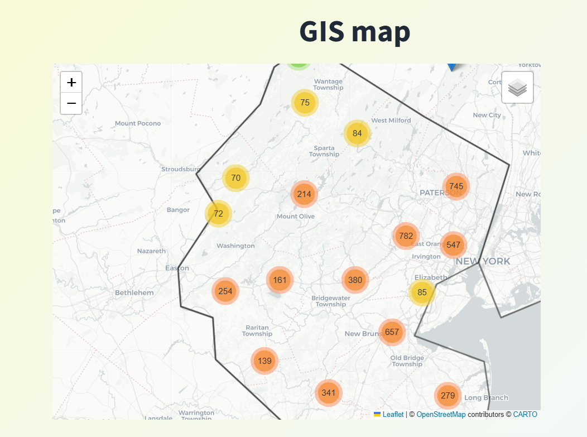
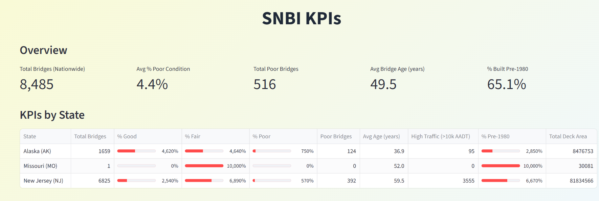
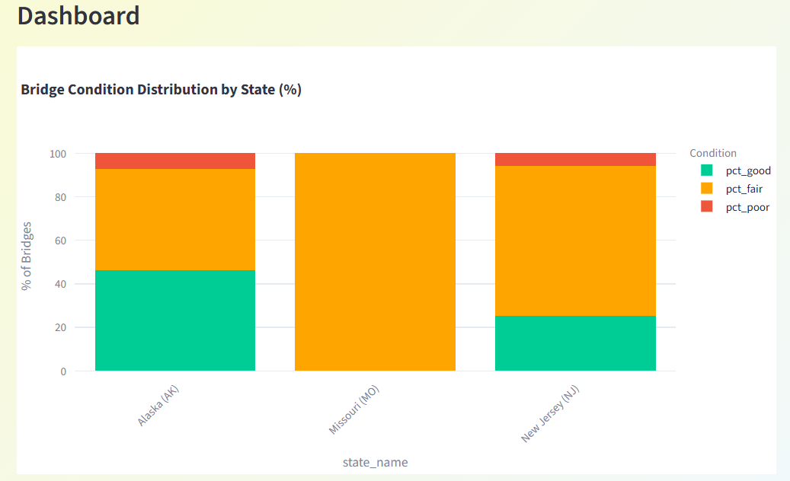
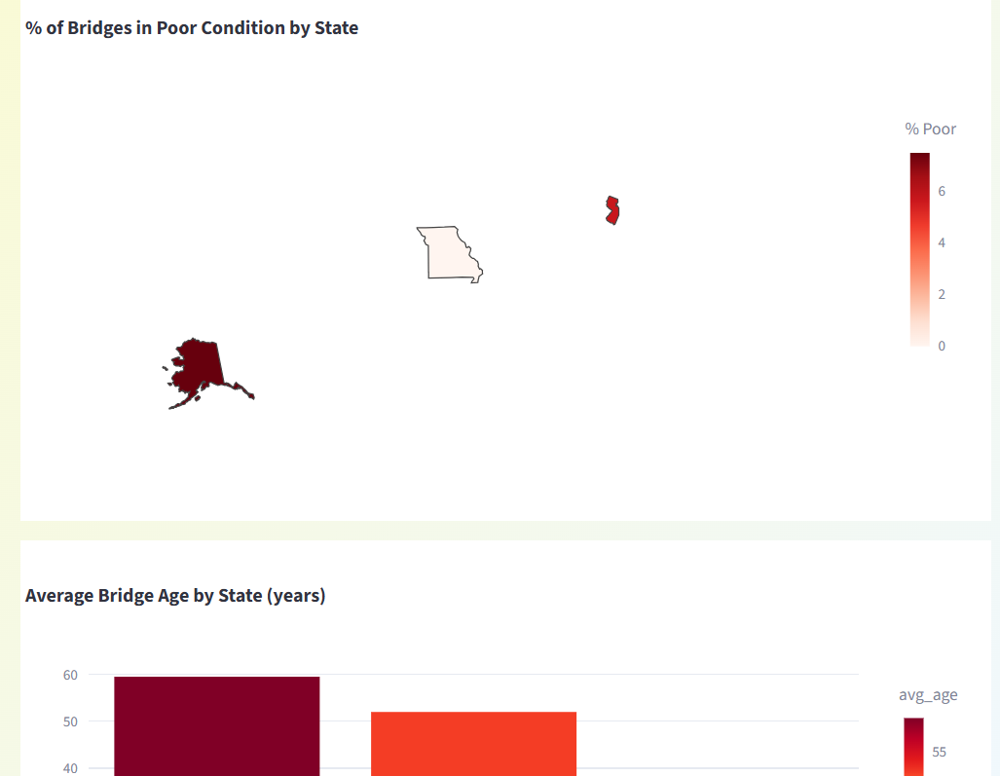
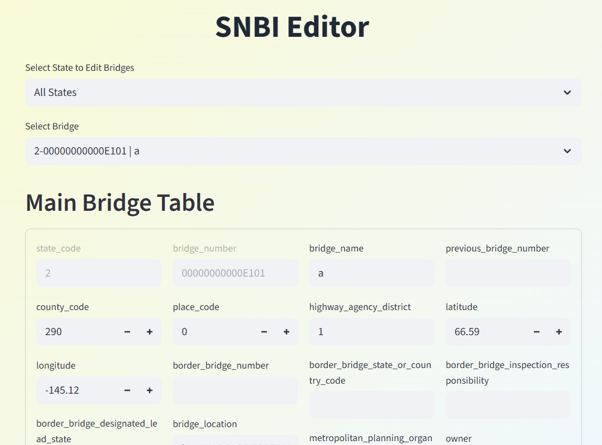
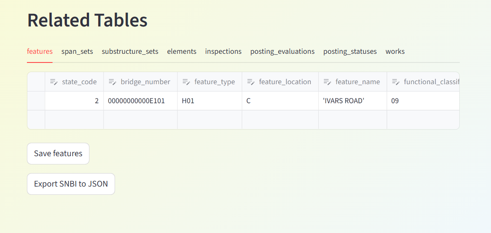

# BridgeGuard - SNBI Bridge Data Management Tool

**BridgeGuard** is a standalone desktop application for managing U.S. bridge inventory data according to the **Specification for the National Bridge Inventory (SNBI)**. It allows users to:

- Convert legacy National Bridge Inventory (NBI) data (TXT + Element XML files) into SNBI-compliant JSON.
- Load SNBI JSON data into a local SQLite database.
- Explore the database with tabular views, an interactive GIS map, and nationwide/state-level KPIs (condition, age, traffic).
- Edit individual bridge records (main + related tables).
- Export single-bridge SNBI JSON files.

The app is built with **Streamlit** and packaged as a Windows desktop executable using `streamlit-desktop-app`. No internet connection or Python installation is required to run the built executable.

## Features

- **NBI → SNBI Converter**  
  Upload an NBI TXT file and matching Element XML file → generates SNBI JSON and saves it locally.

- **SNBI Loader**  
  Upload the generated SNBI JSON → imports all bridges into the local SQLite database (`~/snbi_bridges.db`).




- **SNBI Explorer**  
  - Tabular views of all database tables (bridges, features, elements, span sets, etc.).
  - State filtering.
  - Interactive Folium map showing bridge locations with marker clustering and U.S. state borders.



- **SNBI KPIs Dashboard**  
  Nationwide and per-state statistics:
  - Total bridges, % Good/Fair/Poor condition
  - Average bridge age
  - % built before 1980
  - High-traffic bridges
  - Total deck area
  Visualizations include stacked bar charts, choropleth map of poor condition %, and average age bar chart.






- **SNBI Editor**  
  - Select a state and bridge.
  - Edit the main `bridges` table fields.
  - Edit related tables (features, span sets, elements, etc.) with dynamic rows.
  - Export the selected bridge as a single-bridge SNBI JSON file.




- **Bundled Assets**  
  - Initial empty database (`bridges.db`) is copied to the user folder on first run.
  - App logo/image displayed at the top.

## Requirements (End Users)

- **Windows** operating system.
- **Microsoft Edge WebView2 Runtime** (required for the desktop window).  
  Most modern Windows installations already have it. If the app fails to open, download and install it from:  
  https://developer.microsoft.com/en-us/microsoft-edge/webview2/

No Python or additional software needed.

## How to Run (Built Executable)

1. Download the `BridgeGuard.exe` file (or the entire `dist/BridgeGuard` folder if built as `--onedir`).
2. Double-click `BridgeGuard.exe` to launch.
3. The app will create:
   - `~/snbi_bridges.db` (SQLite database)
   - `~/SNBI_Exports/` folder (for JSON exports)

## Usage Workflow

1. **Convert Legacy Data**  
   Go to the "SNBI Converter" section → upload your NBI TXT and Element XML files → click **Convert to SNBI JSON**.  
   The resulting JSON is automatically saved to `~/SNBI_Exports/snbi_bridges.json`.

2. **Load into Database**  
   Go to "SNBI Loader" → upload the JSON file generated in step 1 → click **Load into SNBI Database**.

3. **Explore & Analyze**  
   Use "SNBI Explorer" to view tables and the map, and "SNBI KPIs" for dashboards.

4. **Edit Bridges**  
   In "SNBI Editor":
   - Select a state.
   - Choose a bridge.
   - Edit fields and related tables.
   - Save changes.
   - Optionally export the bridge as a single JSON file.

## For Developers (Running from Source)

```bash
# Clone or extract the source
git clone <repo>  # or just have app.py + bridges.db + image_bridge.png + logo.ico

# Install dependencies
pip install streamlit streamlit-folium folium plotly pandas sqlite3

# Run locally
streamlit run app.py
```

To build the executable yourself:

```bash
pip install streamlit-desktop-app

streamlit-desktop-app build app.py \
  --name BridgeGuard \
  --icon logo.ico \
  --pyinstaller-options --onedir --noconfirm --windowed \
    --collect-all streamlit --collect-all streamlit_folium --collect-all folium --collect-all plotly \
    --add-data "bridges.db;." --add-data "image_bridge.png;." --add-data "logo.ico;."
```

The executable will appear in `dist/BridgeGuard/`.

## Notes

- The database is stored in your user folder (`~/snbi_bridges.db`). Back it up if needed.
- All JSON exports go to `~/SNBI_Exports/`.
- The app includes defensive parsing and safe defaults for missing/invalid NBI fields.
- Mapping from legacy NBI to SNBI follows FHWA guidelines (partial implementation – some advanced fields may be placeholders).

## License

Personal/internal use. Feel free to modify and extend.

---

*BridgeGuard – Making SNBI data accessible and manageable on the desktop.*


